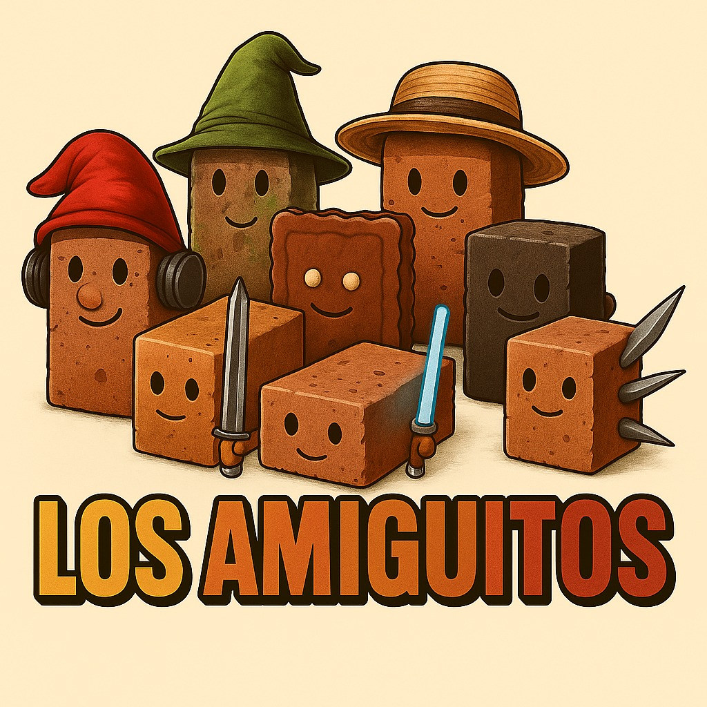

<h1> GACHA DEX</h1>

  

Hello, we are ***Los Amiguitos*** and we present "Gacha-Dex" which is a project where we offer a page about pokemon where you can roll pokemon and collect them. Pokémon can come out in their normal or shiny form, there is also a pity system that the more pity you have the more probability of getting a **LEGENDARY** OR **SHINY**, we have a pokedex that will fill up as you get the pokemon and also an inventory where you can show off your pokemon both in their shiny form and in their normal form and be able to put them as favorites.

<H2> Team members:</H2>

-  **Name**: Dario Montero  
**Rol**: Scrum Master and Programmer  
**Description**: He has a passion for programming and teamwork. He is in charge of the organization and development of the Gacha-Dex project.  

-  **Name**: Santino Rioja  
**Rol**: Programmer and helper database  
**Description**: He has a passion for programming and teamwork. He is in charge of the organization and development of the Gacha-Dex project.  

-  **Name**: Emiliano Estrada  
**Rol**: Programmer  
**Description**: He has a passion for programming and teamwork. He is in charge of the organization and development of the Gacha-Dex project.  

-  **Name**: Agustin Castro  
**Rol**: Programmer  
**Description**: He has a passion for programming and teamwork. He is in charge of the organization and development of the Gacha-Dex project.  

-  **Name**: Thiago Anzaldo  
**Rol**: Programmer  
**Description**: He has a passion for programming and teamwork. He is in charge of the organization and development of the Gacha-Dex project.  

-  **Name**: Gael Baez  
**Rol**: Stylesheet  
**Description**: He has a passion for programming and teamwork. He is in charge of the organization and development of the Gacha-Dex project.  

-  **Name**: Samuel Serrezuela  
**Rol**: Stylesheet  
**Description**: He has a passion for programming and teamwork. He is in charge of the organization and development of the Gacha-Dex project.  

-  **Name**: Ignacio Gonzalez  
**Rol**: Database Designer  
**Description**: He has a passion for programming and teamwork. He is in charge of the organization and development of the Gacha-Dex project.  

I hope you like this project, as it was made with a lot of love. Thank you very much.
						

<b>Los Amiguitos:)</b> 

